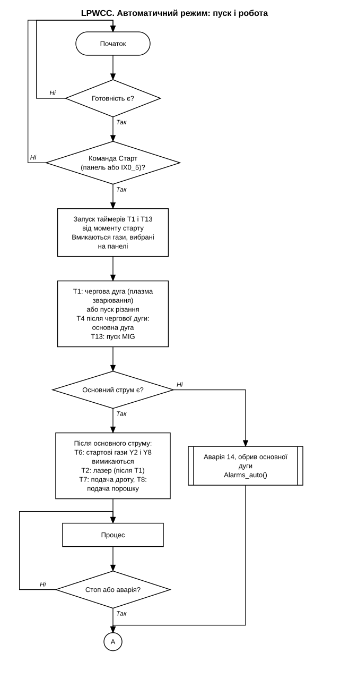
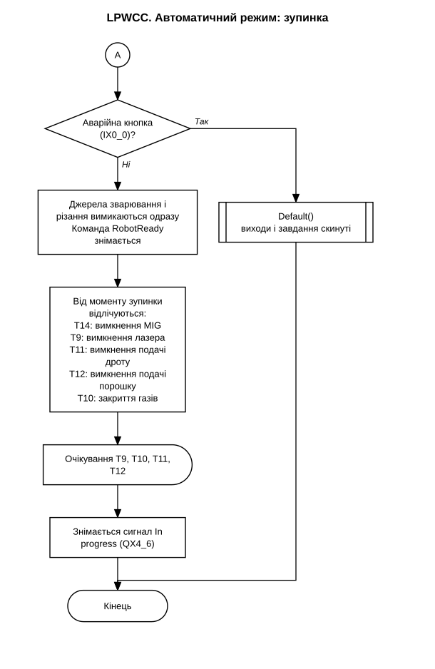

# LPWCC

Програма ПЛК і панелі оператора для лазерно-плазмового зварювально-різального комплексу (ЛПЗР, англ. LPWCC, Laser-Plasma Welding & Cutting Complex).
На одній голові розміщені плазмотрон, імпульсний лазер і джерело MIG, голову переміщує робот. ПЛК керує циклом процесу, газовою системою, подачею дроту й порошку, джерелом Cebora по CANopen, джерелами різання, лазера і MIG та обміном сигналами з роботом.

## Обладнання і ПЗ

- ПЛК: Schneider Modicon TM241CEC24T/U
- Модулі вводу-виводу: 2x TM3DQ8R/G (релейні виходи), 1x TM3DQ8T/G (транзисторні виходи), 2x TM3AQ4/G (аналогові виходи), 1x TM3AI8/G (аналогові входи)
- Панель оператора: Kinco GL100E, зв'язок з ПЛК по Ethernet (Modbus TCP)
- Джерело живлення плазми: Cebora, слейв CANopen на CAN_1
- Джерело різання: уставка струму 0...10 В, пуск реле
- Джерело MIG: уставки напруги і швидкості подачі дроту 0...10 В, пуск реле, вхід наявності дуги
- Робот: Schneider, дискретні сигнали
- SoMachine Logic Builder V4.3, мова Structured Text
- Kinco DTools для панелі

## Режими

Технологічні джерела вибираються на панелі: лазер, плазма (зварювання або різання) і MIG. Їх можна поєднувати, наприклад лазер з плазмою.

Режим симуляції зварювання проходить увесь цикл без запалювання дуги. Використовується для перевірки траєкторій робота.

Робочих режимів два: ручний (`MW0.5 = 1`) для налагодження і автоматичний для роботи разом з роботом.

## Структура програми

Усе викликається з `Main` у задачі MAST:

```
QX4_7:= TRUE;                                           // керування від ЛПЗР (на робот)
IF MW0.5 THEN Alarms_manual(); ELSE Alarms_auto(); END_IF
Measure();
RTRIG1(CLK:= NOT(MW0.5));
IF IX0_0 OR RTRIG1.Q THEN Default(); END_IF             // аварійна кнопка або перехід в автомат
IF MW0.5 THEN Manual(); LaserCut_focus(); ELSE Auto(); END_IF
```

| Програма | Що робить |
|---|---|
| `Main` | викликає решту програм |
| `Auto` | автоматичний цикл, пуск і стоп, усі технологічні таймери |
| `Manual` | пряме керування виходами з панелі |
| `Measure` | масштабування аналогових входів, визначення наявності основного струму |
| `Default` | вимикає всі виходи, скидає генератори імпульсів |
| `Alarms_auto` | аварії в автоматичному режимі (14 кодів) |
| `Alarms_manual` | аварії в ручному режимі, без перевірок робота |
| `LaserCut_focus` | кроковий двигун позиціонування лазерної головки |
| `GVL` | глобальні змінні: входи, виходи і регістри обміну з панеллю |

## Автоматичний цикл

Пуск з панелі виконується через діалог підтвердження "Are you sure". У режимі Remote (`MW34.4`) пуск подається зовнішнім сигналом від робота (`IX0_5`). Він спрацьовує знову лише після того, як сигнал зникне, тому сигнал, що лишився увімкненим, не перезапускає цикл.

Усі затримки зберігаються в регістрах і задаються з панелі. Технологію можна змінити без повторного завантаження програми в ПЛК.

| Затримка | Регістр | Призначення |
|---|---|---|
| T1 | MW56 | пуск чергової дуги або різання після старту |
| T2 | MW58 | пуск лазера |
| T3 | MW60 | аналіз чергової дуги (аварія 13) |
| T4 | MW62 | від появи чергової дуги до команди основної дуги |
| T5 | MW64 | аналіз основної дуги (аварія 14) |
| T6 | MW66 | вимкнення стартових газів після появи основного струму |
| T7 | MW68 | подача дроту |
| T8 | MW70 | подача порошку |
| T9 | MW72 | вимкнення лазера після зупинки |
| T10 | MW74 | закриття газів після зупинки |
| T11 | MW76 | вимкнення подачі дроту після зупинки |
| T12 | MW78 | вимкнення подачі порошку після зупинки |
| T13 | MW134 | пуск MIG |
| T14 | MW136 | вимкнення MIG після зупинки |

Зупинка виконується поетапно: джерела зварювання і різання вимикаються одразу, лазер, газ, дріт, порошок і MIG мають свої затримки вимкнення. Сигнал "In progress" знімається після закінчення затримок T9, T10, T11 і T12.

Наявність основного струму (`MW18.8`) визначається в `Measure`. Залежно від того, яке джерело активне, береться дискретний вхід від джерела різання (`IX0_2`) або MIG (`IX0_3`), зворотний зв'язок від Cebora по CAN або обидва сигнали.

Аналогові входи 4...20 мА. Значення нижче порогу замінюються на точку 4 мА, щоб на панелі був нуль, а не шум.

Вибір режиму AC або DC передається на джерело Cebora через `CAN_SET_DC_AC`.

Змінні Cebora по CANopen:

```
CAN_SET_PilotArc     CAN_GET_PilotArc
CAN_SET_ArcOn        CAN_GET_MainCurrent
CAN_SET_WeldCurrent  CAN_GET_WeldCurrent, CAN_GET_WeldVoltage
CAN_SET_WeldSim      CAN_GET_PlasmaGasFlw, CAN_GET_ShieldGasFlw
CAN_SET_RobotReady
CAN_SET_PlasmaGasFlow, CAN_SET_ShieldGasFlow, CAN_SET_DC_AC
```

## Алгоритм

Блок-схеми побудовані за циклограмою (`docs/cyclogram.gif`) і за `Auto.st`.





## Сигнали робота

| Сигнал | Напрямок | Значення |
|---|---|---|
| `QX4_7` | на робот | керування від ЛПЗР |
| `QX4_4` | на робот | готовність шафи керування |
| `QX4_5` | на робот | є основний струм |
| `QX4_6` | на робот | процес триває (In progress) |
| `IX0_4` | від робота | робот готовий |
| `IX0_6` | від робота | аварія робота |
| `IX0_5` | від робота | зовнішній пуск |

В автоматичному режимі на `QX4_4` подається загальна готовність `MW8.2`. У ручному режимі він складається з окремих бітів готовності лазера, різання, зварювання і MIG.

## Аварії

Код активної аварії записується в `MW100`, прапорець аварії `MW8.1`. Перевірка аварій починається із затримкою (`MW96`) після пуску циклу, щоб короткі перехідні процеси після запалювання не спрацьовували як аварія. Затримка аварійного вимкнення задається в `MW98`.

| Код | Аварія | Код | Аварія |
|---|---|---|---|
| 1 | аварійна кнопка | 8 | низька витрата газу різання |
| 2 | аварія лазера | 9 | низький струм різання |
| 3 | робот не готовий | 10 | низька напруга різання |
| 4 | аварія робота | 11 | низький струм зварювання |
| 5 | низький тиск газу зварювання | 12 | низька напруга зварювання |
| 6 | низький тиск газу різання | 13 | обрив чергової дуги |
| 7 | низька витрата газу зварювання | 14 | обрив основної дуги |

Коди 3 і 4 перевіряються лише в режимі Remote, бо в іншому випадку робот не задіяний. Для обриву чергової та основної дуги команда на Cebora порівнюється з її зворотним зв'язком після окремої затримки, тому звичайний перехід з чергової на основну дугу аварією не вважається.

## Ручний режим

Виходи вмикаються прямо з панелі. Одне слово обміну `MW4` розкладається на біти:

```
WORD_AS_BIT_1(W:= MW4, B01=> QX3_0, B02=> QX3_1, ... B13=> QX4_3);
```

Джерело MIG у ручному режимі отримує уставки напруги (`MW130`) і швидкості подачі дроту (`MW132`), пуск виконується виходом `QX5_3`.

`LaserCut_focus` рухає лазерну головку кроковим двигуном через генератор імпульсів `FreqGen_1`. Два біти з панелі задають напрямок і виключають один одного. Спочатку виставляється напрямок, через 1 мс подається частота зі швидкістю, заданою на панелі (`MW104`). Коли обидва біти вимкнені, частота скидається в нуль і виставляється ENA (стоп).

## Репозиторій

```
PLC/PLC.project    проєкт SoMachine
HMI/               проєкт Kinco DTools
src/               тексти програм, по файлу на програму
docs/              циклограма, електросхеми, таблиці, блок-схеми
```

Файли в `src/` призначені для читання, проєкт збирається з `PLC/PLC.project`.

Документація:

- `docs/cyclogram.gif`: циклограма процесу.
- `docs/schematic/`: електросхеми, `gas-unit-*` для блока газової підготовки, `setup-*` для експериментальної установки.
- `docs/io-table.xlsx`: таблиця входів і виходів.
- `docs/variable-map.xlsx`: карта адрес панелі і ПЛК.
- `docs/mig-pinout.png`: розпіновка роз'єма MIG.
- `docs/algorithm-start.svg`, `docs/algorithm-stop.svg`: блок-схеми алгоритму.

Адреси: `%4X` у панелі і `%MW` у ПЛК означають одне й те саме слово. `%VW` це внутрішні регістри панелі, в ПЛК вони не передаються.

## Як відкрити проєкт

- ПЛК: SoMachine V4.3, відкрити `PLC/PLC.project`. Для пристрою `CEBORA_Power_Source` потрібен EDS-файл `CEBORA_TIG.eds`, який встановлюється в Device Repository.
- Панель: Kinco DTools, відкрити `HMI/PlasnaMIG_HMI.dpj`. Модель панелі GL100E.
- Перед завантаженням перевірити налаштування Modbus TCP і CANopen на реальній машині.
